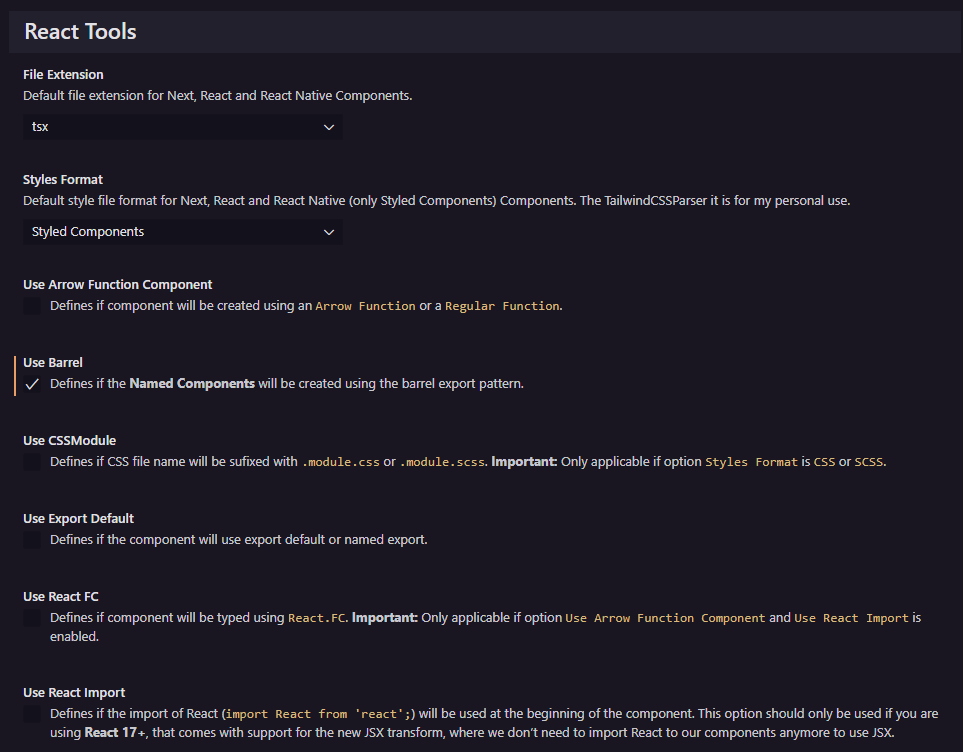
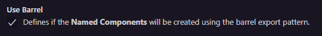
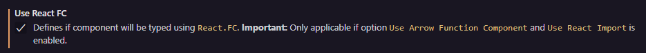
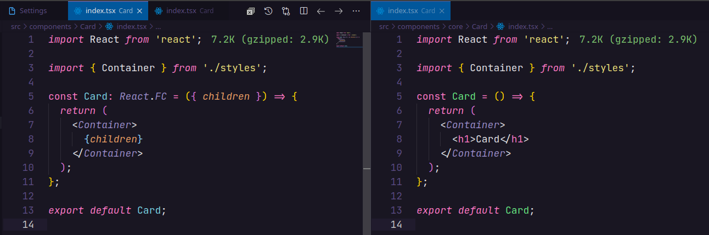
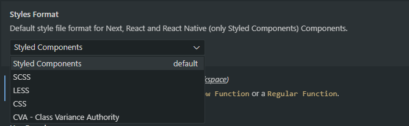

<p align="center">
  <br />
  <a title="Learn more about React Tools" href="https://github.com/ricardoemerson/create-react-tsx-component">
    
    </a>
</p>

# What's new in React Tools 1.10.0
- Added to setting `stylesFormat` the option `CVA - Class Variance Authority` to allow create complex components using this package.
  To use `CVA - Class Variance Authority` you need to add to your `package.json` the packages:
  - `class-variance-authority`;
  - `clsx`;
  - `tailwind-merge`.
  And create this function in `src/services/tailwind-css-util.ts`:
  ```ts
  import { ClassValue, clsx } from 'clsx';
  import { twMerge } from 'tailwind-merge';

  export function cn(...inputs: ClassValue[]) {
    return twMerge(clsx(inputs));
  }
  ```

# What's new in React Tools 1.9.0
- Added the menu item 🧩 Create Next or React Named Component with Styles.
- Added the menu item 📱 Create React Native Named Component with Styles.

# What's new in React Tools 1.8.0
- Change extension name to React Tools.
- The menu items for React JS, Next JS and React Native was separeted in groups.

# What's new in React Tools 1.7.0
- Change icons of the menu items as bellow:
  🧩 Create Next or React Component
  🧩 Create Next or React Component with Styles
  🧩 Create Next or React Named Component
  📑 Create Next Page
  📱 Create React Native Component
  📱 Create React Native Component with Styles
  📱 Create React Native Named Component
- The names of Next JS components and pages have rules that are applied automatically and the extension will apply the Pascal Case or Kebab Case format depending on the situation. So now just type the name of the component or page and the extension will apply the correct pattern.
- Added the setting `useBarrel` that Defines if the **Named Components** will be created using the barrel pattern.
- Added the setting `useExportDefault` that defines if the component will use export default or named export.

## Support

**React Tools** is an extension created for **Visual Studio Code**. If you find it useful, please consider supporting it.

<table align="center" width="100%" border="0">
  <tr>
    <td >
      <a title="PayPal" href="https://www.paypal.com/donate?hosted_button_id=X26H7L6AVMD96">
        
      </a>
    </td>
    <td>
      <a title="Mercado Pago" href="https://mpago.la/1LvP93a">
        
      </a>
    </td>
  </tr>
</table>

# React Tools


[](https://github.com/ricardoemerson/create-react-tsx-component)

This extension creates a Functional Component for Next, React and React Native using Typescript or Javascript with Styled Components, SASS, LESS or CSS.

## Settings

These are all available configurations with their default values.



## Configuration for the Page or Component File (tsx, jsx or js)

By default pages or components files are created using Typescript with files extension `.tsx`. It is also possible to create pages or components with Javascript with files extension `.jsx` or `.js`.


Example of `settings.json`:

```json
{
  "createReactTSXComponent.fileExtension": "tsx|jsx|js"
}
```

## Configuration for create a component using Regular Function or Arrow Function

By default pages or components files are created using `Regular Function`. It is also possible to create pages or components using `Arrow Function`.


Example of `settings.json`:

```json
{
  "createReactTSXComponent.useArrowFunctionComponent": true
}
```

Example of page or component creation using `Regular Function` or `Arrow Function`:


## Configuration for create a named component using Barrel pattern

By default **named components** files are created using `Barrel Pattern` that creates an index file with export of the named component created, where each component created will be included into the index file an export entrance for the new component.



Example of `settings.json`:

```json
{
  "createReactTSXComponent.useBarrel": true
}
```

Example of component creation with `Use Barrel` option enabled:


## Configuration for create components using Export Default

By default components files are created using `named export` instead `export default`.


Example of `settings.json`:

```json
{
  "createReactTSXComponent.useExportDefault": true
}
```

Example of component creation with `Use Export Default` option enabled or disabled:


## Configuration for create a page or component using React.FC.

By default pages or components files are created whithout uses `React.FC`. It is also possible to create pages or components using `React.FC`.

**Important:** This option it is only applicable if option `Use Arrow Function Component` is enabled.



Example of `settings.json`:

```json
{
  "createReactTSXComponent.useReactFC": true
}
```

Example of page or component creation using `React.FC` or not:



## Configuration for create a component using import for React to use JSX.

By default pages or components files are created whithout uses the React import (`import React from 'react';`) it the beginning of the component. It is also possible to create pages or components using the React import.

This option should only be used if you are using **React 16 or previous version**.


Example of `settings.json`:

```json
{
  "createReactTSXComponent.useReactImport": true
}
```

Example of component creation using `import React from 'react';` or not:


## Configuration for the Style File (Styled Components, SCSS, LESS, CSS or CVA - Class Variance Authority)

It is also possible to create components **just for React** using SASS (`.scss`), CSS (`.css`) or using (`CVA - Class Variance Authority`) to define component styles.



Example of `settings.json`:

```json
{
  "createReactTSXComponent.stylesFormat": "Styled Components|SCSS|LESS|CSS|CVA - Class Variance Authority"
}
```

## Configuration for use (CSS Module with SCSS or CSS)

It is also possible use **CSS Module** in the creation of styles for your components **just for SCSS and CSS**. This option, which by default is disabled, adds the suffix `.module.css` or `.module.scss` to the style files created.


Example of `settings.json`:

```json
{
  "createReactTSXComponent.useCSSModule": true
}
```

Example of component creation using styles format `CSS` and `useCSSModule` enabled:


# Usage Examples

You can create a Next, React or React Native Component either by typing in the vscode command palette or by right-clicking any folder in the tree view and use the followed options:

- `Create Next or React Component`
- `Create Next or React Component with Styles`
- `Create Next or React Named Component`
- `Create Next or React Named Component with Styles`
- `Create Next Page`
- `Create React Native Component`
- `Create React Native Component with Styles`
- `Create React Native Named Component`
- `Create React Native Named Component with Styles`

### All Commands (Ctrl+Shift+P or Cmd+Shift+P):


### Mouse Right Click:


## Create Next or React Component with Styles Example:

Select the folder when the component will be created and choose `Create Next or React Component with Styles` and enter the name of the component to be created.


This will create a folder with the component name entered containing the component's `index.tsx` file and the `styles.ts` file for defining the component styles.

## Results

`Card/index.tsx`


`Card/styles.ts`


## Create Next or React Component with Styles using CVA - Class Variance Authority Example:

> First in **stylesFormat** present in **React Tools Settings**, choose **CVA - Class Variance Authority**.

Select the folder when the component will be created and choose `Create Next or React Named Component with Styles` and enter the name of the component to be created.


This will create a file with the component name entered and the file with styles.

## Results

`Card/index.tsx`


`Card/styles.ts`


## Create React Native Component with Styles Example:

Select the folder when the component will be created and choose `Create React Native Component with Styles` and enter the name of the component to be created.


This will create a folder with the component name entered containing the component's `index.tsx` file and the `styles.ts` file for defining the component styles.

## Results

`Header/index.tsx`


`Header/styles.ts`


## Create Next or React Named Component Example:

Select the folder when the component will be created and choose `Create Next or React Named Component` and enter the name of the component to be created.


This will create a file with the component name entered.

## Results

`Card.tsx`


## Create Next or React Named Component with Styles Example:

Select the folder when the component will be created and choose `Create Next or React Named Component with Styles` and enter the name of the component to be created.


This will create a file with the component name entered and the file with styles.

## Results

`Card.tsx`


`Card.styles.ts`


You can also create components without using `Styled Components`.

## Create Next Page Example:

Select the folder when the page will be created and choose `Create Next Page` and enter the name of the page to be created.


This will create a file with the page name entered.

## Results

`products.tsx`


## Next JS Recipe

These settings can be used to create pages using the `Next JS Framework`.

### Settings:


Example of `settings.json`:

```json
{
  "createReactTSXComponent.useArrowFunctionComponent": false,
  "createReactTSXComponent.useReactFC": false,
  "createReactTSXComponent.useReactImport": false
}
```

**Enjoy!**
