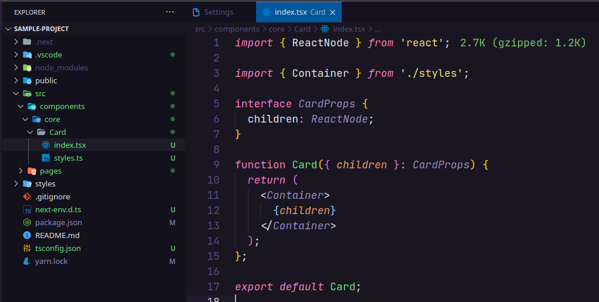

# Create React TSX Component

This extension creates a React Functional Component in a named folder using Typescript and Styled Components.

## Usages

You can create a React Component either by typing `Create Component` or `Create Styled Component` in the vscode command palette or by right-clicking any folder in the tree view.

Enter the name of the component to be created.

This will create a folder with the component name entered containing the component's `index.tsx` file and the `styles.ts` file for defining the component styles.

`Header/index.tsx`

`Header/styles.ts`

**Enjoy!**
