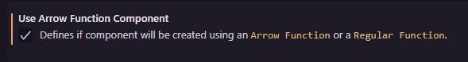
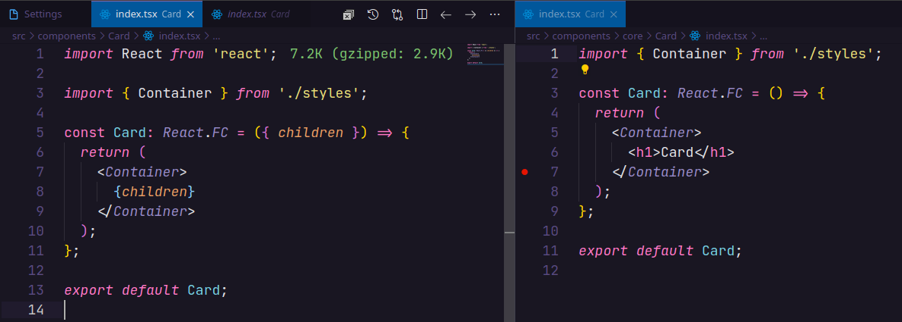
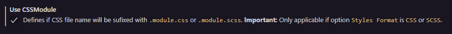
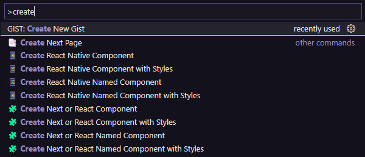
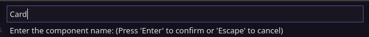
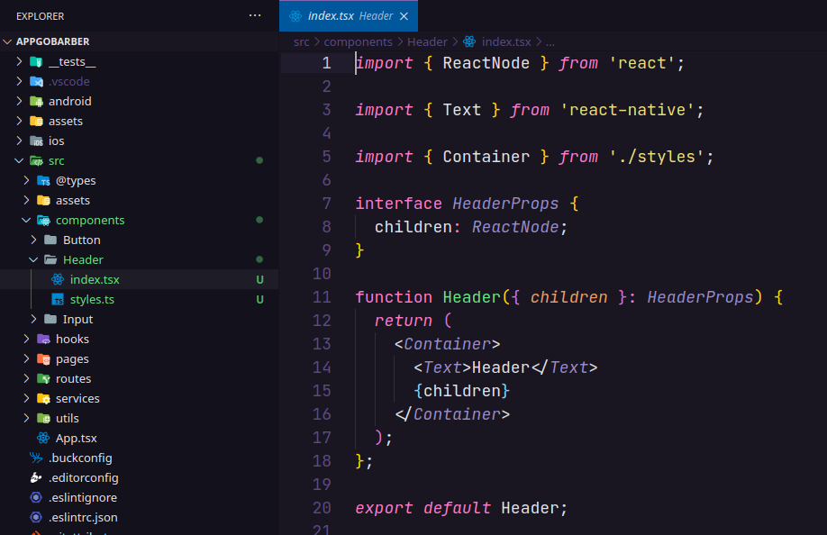
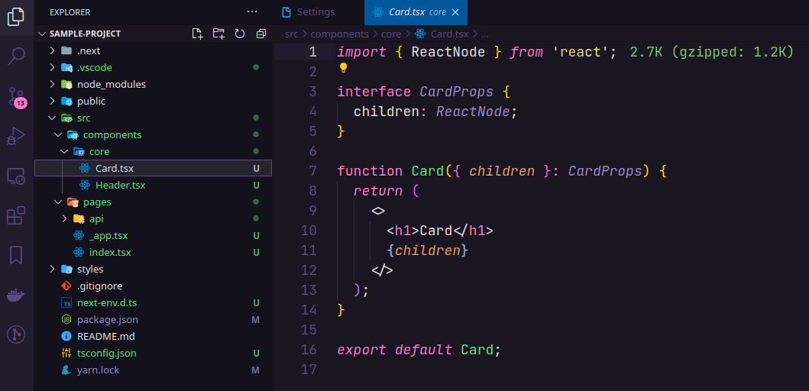

<p align="center">
  <br />
  <a title="Learn more about Create React JS and React Native Component" href="https://github.com/ricardoemerson/create-react-tsx-component">
    
    </a>
</p>

# What's new in Create React JS and React Native Component 1.5

* Adds **Orange Icon** 🔶 for React JS Component Actions.
* Adds **Blue Icon** 🔷 for React Native Component Actions.
* Adds **Create React JS Named Component** for creation of a React JS Component file with a name of component without folder creation.
* Adds **Create React Native Named Component** for creation of a React Native Component file with a name of component without folder creation.
* Adds the setting **useArrowFunctionComponent** that defines if component will be created using an `Arrow Function` or a `Regular Function`.
* Adds the setting **useReactFC** that defines if component will be typed using `React.FC`. **Important:** Only applicable if option `Use Arrow Function Component` and `Use React Import` is enabled.
* Adds the setting **useReactImport** that defines if the import of React (`import React from 'react';`) will be used at the beginning of the component. This option should only be used if you are using **React 17+**, that comes with support for the new JSX transform, where we don’t need to import React to our components anymore to use JSX.
* Adds the setting **useCSSModule** that defines if CSS file name will be sufixed with `.module.css` or `.module.scss`. **Important:** Only applicable if option `Styles Format` is `CSS` or `SCSS`.

## Support

**Create React JS and React Native Component** is an extension created for **Visual Studio Code**. If you find it useful, please consider supporting it.

<table align="center" width="60%" border="0">
  <tr>
    <td>
      <a title="PayPal" href="https://www.paypal.com/donate?hosted_button_id=X26H7L6AVMD96">
        Donate with PayPal
      </a>
    </td>
    <td>
      <a title="Mercado Pago" href="https://mpago.la/1LvP93a">
        Donate with Mercado Pago
      </a>
    </td>
  </tr>
</table>

# Create React JS and React Native Component

[](https://marketplace.visualstudio.com/items?itemName=ricardo-emerson.create-react-tsx-component)
[](https://marketplace.visualstudio.com/items?itemName=ricardo-emerson.create-react-tsx-component)
[](https://marketplace.visualstudio.com/items?itemName=ricardo-emerson.create-react-tsx-component)
[](https://marketplace.visualstudio.com/items?itemName=ricardo-emerson.create-react-tsx-component&ssr=false#review-details)

This extension creates a Functional Component for React JS, React Native and Next JS using Typescript or Javascript with Styled Components, SASS, LESS or CSS.

## Settings

These are all available configurations with their default values.


## Configuration for the Component File (tsx, jsx or js)

By default components files are created using Typescript using files with the extension `.tsx`. It is also possible to create components with Javascript using files with the extension `.jsx` or `.js`.


Example of `settings.json`:

```json
{
  ...
  "createReactTSXComponent.fileExtension": "tsx|jsx|js",
}
```


## Configuration for create a component using Arrow Function or Regular Function

Defines if component will be created using an `Arrow Function` or a `Regular Function`.



Example of `settings.json`:

```json
{
  ...
  "createReactTSXComponent.useArrowFunctionComponent": false,
}
```
Example of component creation using `Arrow Function` or `Regular Function`:


## Configuration for create a component using React.FC for typing.

Defines if component will be typed using `React.FC`. **Important:** Only applicable if option `Use Arrow Function Component` and `Use React Import` is enabled.


Example of `settings.json`:

```json
{
  ...
  "createReactTSXComponent.useReactFC": false,
}
```
Example of component creation using `React.FC` or not:


## Configuration for create a component using import for React to use JSX.

Defines if the import of React (`import React from 'react';`) will be used at the beginning of the component.
This option should only be used if you are using **React 17+**, that comes with support for the new JSX transform, where we don’t need to import React to our components anymore to use JSX.


Example of `settings.json`:

```json
{
  ...
  "createReactTSXComponent.useReactImport": false,
}
```
Example of component creation using `import React from 'react';` or not:



## Configuration for the Style File (Styled Components, SCSS, LESS or CSS)

It is also possible to create components **just for React JS and Next JS** using SASS (`.scss`) or CSS (`.css`) to define component styles.


Example of `settings.json`:

```json
{
  ...
  "createReactTSXComponent.stylesFormat": "Styled Components|SCSS|LESS|CSS",
}
```
## Configuration for use (CSS Modules with SCSS or CSS)

It is also possible use **CSS Module** in the creation of styles for your components **just for SCSS and CSS**. This option, which by default is disabled, adds the suffix `.module.css` or `.module.scss` to the style files created.



Example of `settings.json`:

```json
{
  ...
  "createReactTSXComponent.useCSSModule": true,
}
```
Example of component creation using styles format `CSS` and `useCSSModule` enabled:


## Usage Examples

You can create a React or React Native Component either by typing in the vscode command palette or by right-clicking any folder in the tree view and use the followed options:
- `Create React JS Component`
- `Create React JS Component with Styles`
- `Create React JS Named Component`
- `Create React Native Component`
- `Create React Native Component with Styles`
- `Create React Native Named Component`

### All Commands (Ctrl+Shift+P or Cmd+Shift+P):


### Mouse Right Click:


## Create React JS Component with Styles Example:

Select the folder when the component will be created and choose `Create React JS Component with Styles` and enter the name of the component to be created.



This will create a folder with the component name entered containing the component's `index.tsx` file and the `styles.ts` file for defining the component styles.

## Results

`Header/index.tsx`


`Header/styles.ts`


## Create React Native Component with Styles Example:

Select the folder when the component will be created and choose `Create React Native Component with Styles` and enter the name of the component to be created.


This will create a folder with the component name entered containing the component's `index.tsx` file and the `styles.ts` file for defining the component styles.

## Results

`Card/index.tsx`



`Card/styles.ts`


## Create React JS Named Component Example:

Select the folder when the component will be created and choose `Create React JS Named Component` and enter the name of the component to be created.


This will create a file with the component name entered.

## Results

`Header.tsx`



You can also create components without using `Styled Components`.

## Next JS

These settings can be used to create components using the `Next JS Framework`.

### Settings:


Example of `settings.json`:

```
{
  ...
  "createReactTSXComponent.useArrowFunctionComponent": false,
  "createReactTSXComponent.useReactFC": false,
  "createReactTSXComponent.useReactImport": false,
}
```

### Create React JS Named Component Example:

Select the folder when the component will be created and choose `Create React JS Named Component` and enter the name of the component to be created.


This will create a file with the component name entered.

#### Results

`Product.tsx`


## ESLint for Airbnb Code Style

To resolve issues such as:

### Using Typescript

- Import `.ts` files without informing the file extension;
- Use `jsx` code in `tsx` files.

The `eslint-import-resolver-typescript` plugin should be used as a development dependency and include the rules and settings below into `.eslintrc.json`.

```json
  ...
  "rules": {
    "react/jsx-filename-extension": ["error", { "extensions": [".tsx"] }],
    "import/extensions": ["error", "ignorePackages", { "ts": "never", "tsx": "never" }],
  },
  "settings": {
    "import/resolver": {
      "typescript": {}
    }
  }
}
```

### Using Javascript

To use `jsx` code in `js` files, include the rule below into `.eslintrc.json`.

```json
  ...
  "rules": {
    "react/jsx-filename-extension": ["error", { "extensions": [".js", ".jsx"] }],
  }
}
```

**Enjoy!**
