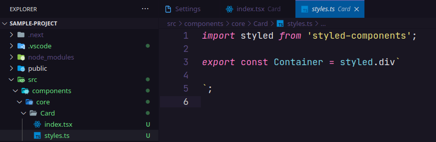
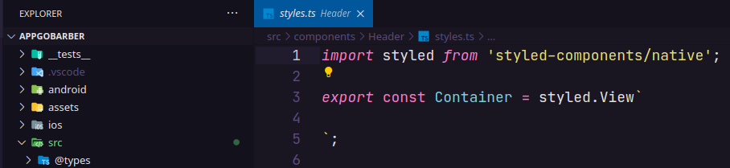

# Create React JS and React Native Component

[](https://marketplace.visualstudio.com/items?itemName=ricardo-emerson.create-react-tsx-component)
[](https://marketplace.visualstudio.com/items?itemName=ricardo-emerson.create-react-tsx-component)
[](https://marketplace.visualstudio.com/items?itemName=ricardo-emerson.create-react-tsx-component)
[](https://marketplace.visualstudio.com/items?itemName=ricardo-emerson.create-react-tsx-component&ssr=false#review-details)

This extension creates a Functional Component for React JS and React Native in a named folder using Typescript or Javascript with Styled Components, SASS, LESS or CSS.

## Configuration for use (tsx, jsx or js)

By default components files are created using Typescript using files with the extension `.tsx`. It is also possible to create components with Javascript using files with the extension `.jsx` or `.js`.


Example of `settings.json`:

```json
{
  ...
  "createReactTSXComponent.fileExtension": "tsx|jsx|js",
}
```

## Configuration for use (Styled Components, SCSS LESS or CSS)

It is also possible to create components **just for React JS** using SASS (`.scss`) or CSS (`.css`) to define component styles.


Example of `settings.json`:

```json
{
  ...
  "createReactTSXComponent.stylesFormat": "Styled Components|SCSS|LESS|CSS",
}
```

## Usage Examples

You can create a React or React Native Component either by typing `Create React JS Component` or `Create React JS Styled Component` or `Create React Native Component` or `Create React Native Styled Component` in the vscode command palette or by right-clicking any folder in the tree view.


Enter the name of the component to be created.


This will create a folder with the component name entered containing the component's `index.tsx` file and the `styles.ts` file for defining the component styles.

## Results

### React JS

`Header/index.tsx`


`Header/styles.ts`



### React Native

`Card/index.tsx`


`Card/styles.ts`



You can also create components without using `Styled Components`.

## ESLint for Airbnb Code Style

To resolve issues such as:

### Using Typescript

- Import `.ts` files without informing the file extension;
- Use `jsx` code in `tsx` files.

The `eslint-import-resolver-typescript` plugin should be used as a development dependency and include the rules and settings below into `.eslintrc.json`.

```json
  ...
  "rules": {
    "react/jsx-filename-extension": ["error", { "extensions": [".tsx"] }],
    "import/extensions": ["error", "ignorePackages", { "ts": "never", "tsx": "never" }],
  },
  "settings": {
    "import/resolver": {
      "typescript": {}
    }
  }
}
```

### Using Javascript

To use `jsx` code in `js` files, include the rule below into `.eslintrc.json`.

```json
  ...
  "rules": {
    "react/jsx-filename-extension": ["error", { "extensions": [".js", ".jsx"] }],
  }
}
```

**Enjoy!**
